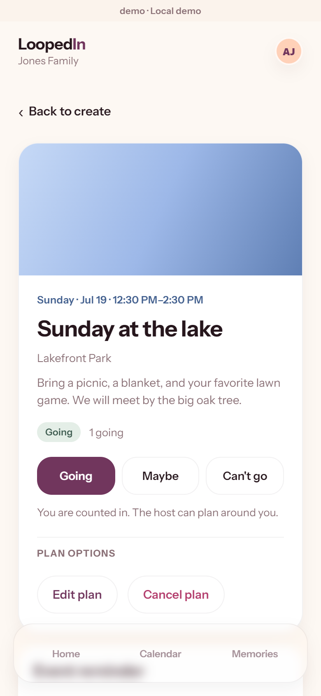
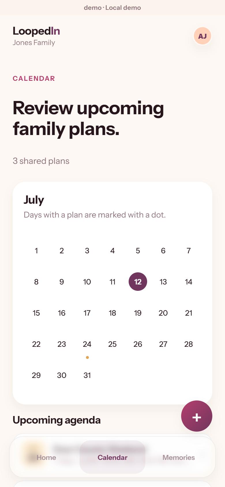
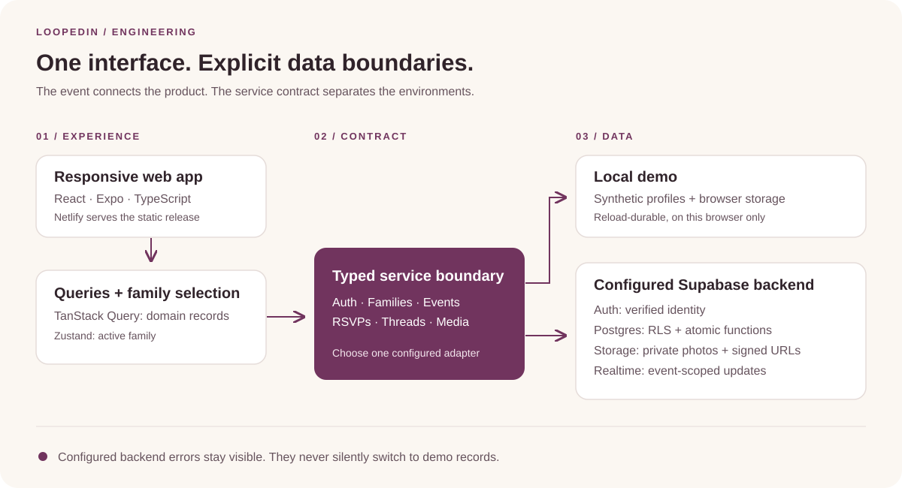

<p align="center">
  
</p>

<p align="center">
  <strong>A private place for your family's plans, conversations, and memories.</strong><br />
  Built for phone browsers. Comfortable on desktop.
</p>

<p align="center">
  <a href="https://loopedin-family.netlify.app">Open LoopedIn</a> ·
  <a href="#a-look-inside">See the app</a> ·
  <a href="#how-its-built">Explore the engineering</a> ·
  <a href="GETTING_STARTED.md">Run locally</a>
</p>

## One plan. Everyone in the loop.

A weekend away starts with a date, turns into a conversation, and ends with photos worth keeping. LoopedIn keeps those pieces together around the event, inside your family's private space.

| Before the event | During the event | After the event |
| --- | --- | --- |
| Create the plan, invite your people, and see who's coming. | Keep logistics, RSVPs, and conversation in one place. | Add photos and revisit completed plans as family memories. |

### What you can do

- **Make a private family space.** Create an account, confirm your email, name your family, and invite people by email. Joining an existing family requires an invitation.
- **Plan together.** Create and edit events, browse the shared calendar, and respond Going, Maybe, or Can't go.
- **Keep the conversation attached.** Each event has its own thread, with live updates in configured Supabase mode.
- **Save the moments.** Share event photos with captions and image descriptions. Completed events become memories with their conversation and photos intact.
- **Manage your people and account.** Membership roles, invitations, password recovery, and encrypted exports have dedicated flows.

## A look inside

<table>
  <tr>
    <th align="center">The plan, in one place</th>
    <th align="center">A shared view of what's next</th>
  </tr>
  <tr>
    <td width="50%" align="center"></td>
    <td width="50%" align="center"></td>
  </tr>
</table>

*Captured from the real web build using synthetic local demo records and a fixed demo date. No private family data is shown. The cover is an AI-generated brand illustration, not an application screenshot. [Asset notes](docs/assets/README.md).*

## Project status

**Working beta · September 17, 2026.** The hosted app is available, with its runtime still labeled `loopedin-staging` while release acceptance continues.

| Evidence | Current position |
| --- | --- |
| Real family use | The owner reports working invitations, family membership, event creation, and persistence. |
| Latest application checks | 181 automated tests passed, plus app/workflow lint, TypeScript, and the repository secret scan. These are dated local results, not a continuously green CI claim. |
| Deployed build | Release `0.1.0-bd1a2c078aaa` was checked against all 14 served application/configuration/manifest files. |
| Photo upload correction | The selected-file browser policy failure was reproduced and fixed. The corrected reader passed browser checks; the user's original photo still needs a live retry. |
| Before a broader launch | Complete attended email/recovery and physical-phone acceptance, and restore ongoing backup, restore-test, and monitoring coverage. |

**Current limits:** photo files must be JPEG, PNG, or WebP and no larger than 1 MiB; automatic resizing is not implemented. Event reminders save an in-app preference; push and reminder-email delivery are not active. This is a responsive web app, with no native app-store release.

See the [release status](GO-LIVE.md) and [dated verification log](evals/review-log.md) for evidence and remaining work.

## How it's built



| Layer | Technology and responsibility |
| --- | --- |
| Interface | TypeScript, React, Expo, and React Native Web. Shared responsive screens and browser history routes. |
| State | TanStack Query owns server records and scoped refetches. Zustand holds active-family selection. |
| Service boundary | A typed contract supports a durable local demo adapter and a configured Supabase adapter. Backend failures never silently substitute demo records. |
| Identity and data | Supabase Auth, Postgres row-level security, and narrowly scoped database functions enforce membership and authorized changes. |
| Photos and updates | Private Supabase Storage, signed media URLs, and event-scoped Realtime subscriptions. |
| Delivery | Static web artifacts on Netlify, runtime configuration, content hashes, and retained deployment versions for frontend rollback. |

### Engineering decisions worth exploring

**Authorization lives with the data.** Private-family access is enforced in Postgres, rather than relying on hidden buttons. A verified account can create one family; joining another still requires an email-bound invitation. [Onboarding and database boundaries →](docs/runbooks/public-family-onboarding.md)

**Retries respect what already happened.** Event and comment creation retain operation keys across an unchanged manual retry, so a lost response can recover the committed record without creating a duplicate. [Data flow and retry design →](docs/architecture.md#data-flow-and-state)

**Photo uploads have a recoverable lifecycle.** Pending, active, and deleting states coordinate metadata with private object storage. Selected files are decoded locally before validation and upload. [Media lifecycle →](docs/runbooks/remote-media-readiness.md)

**A release is an identifiable artifact.** Builds carry the source commit and a SHA-256 manifest. Hosted-file comparisons distinguish a successful local build from the bytes actually served. [Release and rollback →](docs/runbooks/web-release-and-rollback.md)

## Run locally

Use **Node.js 22** and npm. The default mode uses synthetic demo profiles and browser-local persistence; a Supabase account is not needed to explore it.

```powershell
git clone https://github.com/CosmonautJones/family-loop.git
cd family-loop
npm --prefix app ci
npm --prefix app run web
```

Open the local address printed by Expo and choose a demo profile. Local demo data belongs to that browser; cross-device family collaboration uses the configured backend.

### Check your changes

From the repository root, after installing app dependencies. **PowerShell 7** is also required by the workflow linter.

```powershell
npm test
npm run lint
node app/node_modules/typescript/bin/tsc --project app/tsconfig.json --noEmit
npm run check:secrets
```

These checks run locally without GitHub Actions minutes. Hosted CI and scheduled operations are currently deferred; local linting does not replace backups or monitoring.

[Full setup and troubleshooting →](GETTING_STARTED.md) · [Contribution guide →](CONTRIBUTING.md)

## Explore the repository

```text
app/src/       Screens, domain types, service adapters, and query state
supabase/      Forward migrations, database policies, and Edge Functions
tests/         Unit, contract, integration, and hosted acceptance harnesses
scripts/       Local checks, release packaging, and operations tooling
docs/          Architecture, product decisions, runbooks, and visual assets
evals/         Dated verification evidence and product/code review criteria
```

| Start here | What you'll find |
| --- | --- |
| [Documentation guide](docs/README.md) | A short route through current references and historical design work. |
| [Product vision](docs/vision.md) | The audience, purpose, and phone-first experience. |
| [Architecture](docs/architecture.md) | Service boundaries, state ownership, privacy, and data flow. |
| [Release status](GO-LIVE.md) | What's deployed, what's proven, and what's still open. |
| [Verification log](evals/review-log.md) | Dated results with explicit limits on each claim. |

---

<p align="center"><strong>Make the plan. Be there. Keep the memory.</strong></p>
