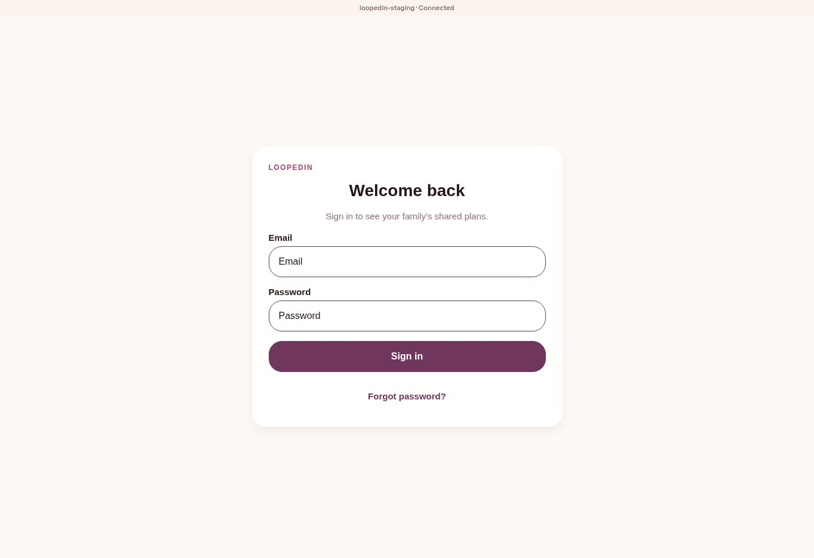

# Published staging release and retest — 2026-09-13

**DEPLOYED; hosted artifact and availability checks PASS.** This checkpoint supersedes the earlier upload-access blocker. Direct Netlify CLI authentication was authorized through a user-approved login ticket. No credential or authorization ticket is retained in this evidence.

- Site: `loopedin-family` (`50ae6d6b-28ad-49c0-9654-c3a54899fcb5`).
- Published URL: https://loopedin-family.netlify.app
- Exact app source: `c6c0de82de926a173102d4cdab13202cac70905c`.
- Release: `0.1.0-c6c0de82de92`.
- Artifact SHA-256: `d123f97d3cbfffedaaf4c4605a3d520dcb32ba9d2b976bfefcc3a5296f186b17`.
- Preview deploy: `6aa6b6c250d7dc5bd78fdfa1`; [preview check](preview-check.json) passed before publication.
- Published deploy: `6aa6b736b29ebed58613109d`; [immutable URL](https://6aa6b736b29ebed58613109d--loopedin-family.netlify.app).
- Rollback target retained: `6aa2a671aa89755f10dca32c`. No rollback was necessary or rehearsed in this release.

## Actual upload

The original envelope reverified before upload. Netlify CLI uploaded it using `deploy --dir <verified-envelope> --site 50ae6d6b-28ad-49c0-9654-c3a54899fcb5 --no-build --json`, then the same directory with `--prod` after the preview verification passed. The provider did not rebuild source. `--prod` selects this site's published alias; its runtime remains `loopedin-staging` with the same dedicated backend. No database migration or backend/user mutation was performed. No source-build proxy command was used.

[Preview deployment response](preview-deploy.json) and [published deployment response](published-deploy.json) record provider identities.

## Hosted retests

| Check | Result |
| --- | --- |
| Hosted manifest equals local verified manifest | PASS |
| All 11 manifest-listed files match expected size and SHA-256 | PASS on preview and published alias |
| Content-addressed asset immutable caching | PASS |
| Runtime configuration exactly equals reviewed staging overlay | PASS |
| Runtime no-store; shell no-cache; release/environment headers | PASS |
| CSP includes staging backend; nosniff and HSTS | PASS |
| Missing static asset | HTTP 404 |
| Public availability checker | PASS: shell/runtime/Auth HTTP 200; release identity correct |
| Browser after navigating to published alias | Welcome back sign-in form and loopedin-staging connected-backend banner observed |

[Published hash/policy check](published-check.json) completed at `2026-09-13T14:47:27.126Z`. [Availability check](published-availability.json) completed at `2026-09-13T14:47:48.012Z`. These are actual hosted results, separate from the earlier 177/177 local suite and eight virtual-family scenarios. One observed shell request took 8,407 ms and Auth health took 6,240 ms in the checking environment; no latency SLO or performance benchmark is claimed.

The [verification script](verify-hosted.mjs) is the exact script executed. Its `/tmp/loopedin-release-tools/` paths refer to the retained local release artifact and reviewed runtime overlay; recreate those paths or adapt them to the corresponding trusted files when reproducing. Run `node verify-hosted.mjs <preview-or-published-origin>`. It makes public read-only requests. The existing repository `scripts/check-hosted-availability.mjs` provided the separate availability result.

## Remaining limits

Authenticated user journeys, browser rendering of the changed Home/calendar screens, real cross-device edits, email delivery, physical phones, and assistive technology were not retested. The browser was signed out; deployment login authorizes Netlify, not a family-app account. The existing local simulation and source tests cover the two fixes but are not substitutes for those journeys. This release does not certify production readiness. PR #19 remains the code/evidence review branch; deployment does not imply it was merged.
