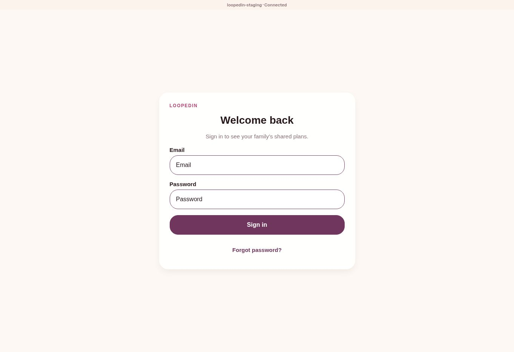

# Virtual family simulation evidence — 2026-09-13

Eight executable family scenarios pass, and two demonstrated app defects were corrected. This record is local test evidence, not proof of production readiness or of a successful hosted CI run.

## Provenance and reproduction

The starting source was commit `984ff71e810bd8a86a6e31a3118967da590caf24`. All 303 original repository blobs were retrieved at that immutable revision and matched Git blob hashes before edits. [source-manifest.json](source-manifest.json) records the environment and SHA-256 hashes of the tested code, suite, and dependency lockfile. The commit containing this evidence records the complete patch. The local snapshot commits used for testing are not remote-history commits.

See the [runbook](../../runbooks/virtual-family-simulation.md) for setup, exact commands, the scenario matrix, design of the synthetic storage boundary, and remaining release gates. Tests are [in the codebase](../../../tests/virtual-family-week.test.js), not prose-only hypothetical outcomes.

## Recorded executions

| Check | Result | Raw evidence |
| --- | --- | --- |
| Baseline `npm test` before this patch | 168 passed, 1 failed: stale availability schedule assertion | [baseline.log](baseline.log) |
| Focused new regressions before selector fixes | 2 failed: ongoing Home event absent; wrong-year calendar highlight | [regressions-before-fix.log](regressions-before-fix.log) |
| Final `npm run test:simulation` | 8 passed, 0 failed | [simulation.log](simulation.log) |
| `TZ=Asia/Tokyo node --test tests/virtual-family-week.test.js` | 8 passed, 0 failed | [simulation-tokyo.log](simulation-tokyo.log) |
| Final root `npm test` | 177 passed, 0 failed | [full-suite.log](full-suite.log) |
| App `npm run lint`, then `npx tsc --noEmit` | Both exited 0; TypeScript emitted no findings | [lint-typecheck.log](lint-typecheck.log) |
| Existing Metro compatibility script, then local Expo web export | Export completed, exit 0 | [web-build.log](web-build.log) |
| Tracked-file secret scan and migration checksum validation | See final gate output | [repository-gates.log](repository-gates.log) |

Only trailing whitespace was stripped from log lines for repository formatting; results and messages are unchanged. The first two logs intentionally retain failing output as before-fix evidence. The focused red run used the initial calendar fixture in UTC; independent review subsequently corrected its local-day construction to make it portable across timezones. Historical stack line numbers therefore differ from the final suite. The npm proxy-configuration warning in some logs is an environment warning, not a failed test. Build output is an ordinary local export, not a signed or immutable hosted release artifact.

## Review and observation

A separate read-only code reviewer examined the selectors, Home label, new suite, and updated existing assertion. Initial verdict: change requested because a fixed-offset calendar timestamp crossed midnight in Asia/Tokyo. The fixture was changed to local Date construction. Reviewer reran the focused Tokyo case (1/1 passed) and returned PASS, with no remaining blockers in those four files. This is an agent code review, not a human usability study or GitHub-required approval.

The hosted site `https://loopedin-family.netlify.app` rendered a signed-out “Welcome back” screen with a `loopedin-staging` connected-backend banner. The screenshot below proves only that entry-screen observation; it predates deployment of this patch and does not show authenticated functionality or the changed Home screen.

Local preview navigation was blocked by the browser environment. No login, actual browser refresh journey, invitation delivery, Supabase mutation/RLS probe, backup restoration, physical-phone check, or authenticated accessibility audit was performed in this session. Synthetic concurrency is 18 promises in one process, not a load benchmark or cross-device conflict proof. The test's tiny image is a synthetic payload, not a real photo-storage delivery check.

## Readiness conclusion

The local family loop has repeatable passing evidence, and Home/calendar correctness improved. Hosted authentication, invitation/email delivery, backend permissions, device usability, and an exact-candidate deployment check remain release gates. No production-ready grade or launch claim follows from these results. Monitoring and backup schedules are unchanged by this simulation patch.
